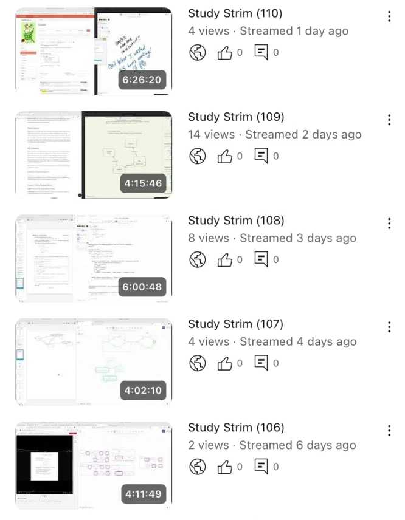

## Introduction
Whenever it's time to take public transport, I always ensure that I've got my airpods in with noise cancellation to zone out during the ride. Whenever it's time to eat, it is vital that I find a delectable 20+ minute youtube video.

I came to the realisation that I'd Pavlovian[^9] dogged myself to these habits whenever something mildly mundane were to occur. While I hadn't fallen to the atrocity of using my phone while with mates, my condition was getting no better. So, I decided to create a challenge for myself with the inspiration of people raw dogging flights for hours at a time[^1] and other videos I'd seen[^2] in order to try and break out of this instinctive escapism.

## The Challenge
The purpose of the challenge was simple; if something seems boring, just sit with the boredom and *listen to the silence* (Note this is not some productivity ploy; it's about being present in the moment). This lays the foundation for a couple of concrete rules for the month of May 2025:

- No music or podcasts while on public transport, doing grocery shopping, cooking, running or studying
- No scrolling while on the toilet
- No youtube while eating

One point of contention that popped up was the reading of books to pass the time. While many deem it to be a noble way of acquiring knowledge, in the late 18th century when printing and literacy rates had gone up considerably, some pointed out novels to be particularly unpalatable.

> "*Women, of every age, of every condition, contract and retain a taste for novels. The depravity is universal. My sight is everywhere offended by these foolish, yet dangerous, books. I find them on the toilette of fashion, and in the work-bag of the sempstress; in the hands of the lady, who lounges on the sofa, and of the lady, who sits at the counter. From the mistresses of nobles they descend to the mistresses of snuff-shops – from the belles who read them in town, to the chits who spell them in the country. I have actually seen mothers, in miserable garrets, crying for the imaginary distress of an heroine, while their children were crying for bread: and the mistress of a family losing hours over a novel in the parlour, while her maids, in emulation of the example, were similarly employed in the kitchen. I have seen a scullion-wench with a dishclout in one hand, and a novel in the other, sobbing o’er the sorrows of Julia, or a Jemima*" - (Sylph no. 5, October 6, 1796: 36-37)[^3]

These criticisms seem to mirror the complaints we see today in the 21st century about the unbridled use of technology. So, in an effort to maintain timeless partiality, I decided to prohibit the reading of books to pass the time.

With this, it was time to tackle the challenge head on. Being merely a month long, how hard could it be...
## Week 1
The first week was rough. This period was probably the most I studied since high school. I would spend like 4 hours studying for my compilers exam and then another 4 hours practising for job interviews each day. 

My routine was: brekky, study, lunch, study, dinner, study and sleep. My brain was fried and the silence I got during meals actually seemed to aid in keeping me diligent. This is because during meals with this extra time, I would actively plan out my loose timetable. During this short season of locking in, I came to notice just how loud my own chewing was as it echo'ed through my skull. It was kinda weird.

There was also a time I instinctively grabbed my phone before heading to the toilet. Only until I had reached the bathroom's entrance did I realise what sins I was about to commit. So, I had to walk all the way back to my desk and put my phone down before going back to sitting intimately with the poo.

Although scrolling and yt was banned while eating, checking messages was not. But after reading some messages from my mate kev, I jumped straight to instagram like a buffoon[^4] and only realised and cut it out after 2 reels. I had already failed but at least I had a new strategy moving forward; don't even bring your phone to the dining table.

As the end of the week approached, so did my compilers exam. I gave myself an exception to read over some notes on the train and ended up acing that exam with flying colours (not to flex, but to flex; I got a 99 overall). So, on the silent train ride home while being too caught up giving myself a pat on the back, I saw a person scrolling reels in front of me. I tried to lean to the side and look over their shoulder to get a better view at their screen. I had to stop myself in the moment and force myself to look out the window as if I was pretending to be thinking while in an exam room. So, I made a mental note of a new amendment; looking at someone else's reels would be against the spirit of the rules. 
## Week 2
As my exams were complete, it was time to celebrate my well-deserved break. Even though I was finishing my meals blazing fast due to the lack of distractions, I still found myself getting bored having my eyes dart around the room looking for something to consume. It was pretty funny when I started reading the contents on the cereal boxes I had for breakfast which gave me a whiff of nostalgia taking me back to my younger years when I'd do the exact same thing.

In order to hit my 20km/week running goal, I went on a run without any music. I found that it wasn't particularly difficult because if I ever felt bored, I could just run faster. In this way, the pain of keeping my legs moving and lungs breathing would outweigh any thoughts of monotony.

<iframe width="286" height="509" src="https://www.youtube.com/embed/3xbmCZlyuhg" title="running with drumstick" frameborder="0" allow="accelerometer; autoplay; clipboard-write; encrypted-media; gyroscope; picture-in-picture; web-share" referrerpolicy="strict-origin-when-cross-origin" allowfullscreen></iframe>

Additionally, without spotify, sometimes my inner monologue would break out into song mid run. Though this was a cost effective music streaming platform that happened to play some bangers, it did have the downside of repeating the same song over and over again, only ever shuffling when I didn't think about changing to another song. At other times while running, the radio station would switch off, and I would just be left with my thoughts replaying blunders that I'd made in technical interviews incessantly. That did not make me jump for joy but I guess I won't make those mistakes ever again.

I also went on to finish reading 'The Little Prince'[^13] way into the still night at 3am (Don't ask me why I was reading a kid's book, ask the one who gave me that drumstick in the above video). Feeling a bit peckish, I got myself some nutella toasties. My goodness, the urge to watch a yt video that late into the night with a cheeky snack was practically insatiable.
## Week 3
With the extra free time, I decided to get back on some digital art. As a natural reflex, I hopped onto twitch to find a random yapper that I could use as background noise. It took me a second to catch myself in the act as I realised this would be against the spirit of the challenge. So this new amendment was added. Since drawing is a mentally demanding and intriguing task, doing it in silence was a vibe.

This week I had also went on a cheeky 14km run with a mate (no earphones of course). This was a breeze as we had each other for company during the run. Even during moments of no talking, just having 'em by my side meant I didn't even remotely feel the need to listen to music. Maybe it was because it was a nice area to run in? Unfortunately, this was the run that kissed my knee with iliotibial band syndrome[^14] (ITB). So, running was out of the picture for me for the rest of the month.

There was this one time I was cooking for the week but for some reason it was taking incredibly long. Without any music, I was just cutting chicken and vegetables and all that jazz slowly and somehow ended up taking about 3 hours to cook just 4 meals in advance. That was utterly devastating.

By this time, I was starting to get withdrawals while eating without my instant gratification. The pain of childbirth couldn't compare to this agony as I listened to my chewing staring at a blank tv screen - I was practically shaking. So, periodically, I would need to just stand up and take a deep breath, sometimes doing some reps on the door frame pull up bar.
## Week 4
Getting towards the end of the challenge, I found myself noticing things like the weather a bit more; the smell of the air, the warmth of the sun and the sound of the rain for example. While on my way to and fro volleyball in the rain, I would previously just focus purely on the dry destination while avoiding getting my socks wet. But during the challenge, I would heed the ambience and rediscover the beauty of Sydney in the rain (dw about 'track work' mate) if it so happened that my socks were dry. Maybe it's my Neolithic[^5] brain, but the smell, the 'pitter-patter' and the reflection of the lights in the puddles - my goodness it's aesthetic.

I also started listening to people's conversations on the train. Its pretty funny to see what different demographics tend to speak about. Additionally, I found myself staring at people like an attentive German[^6]. While I picked up the habit of analysing random people's fits, their noses, face structure, their hair and the such from when I started reading Loomis[^7], I found myself doing it a lot more on public transport during this challenge.

With all the suffering I had to endure for this random challenge, I noticed a strong inclination to bring up my toils in conversation. I wanted to tell people about my superiority because of this detox. While it is in good banter, I do need to humble myself having failed the challenge multiple times.

Singing out loud and humming had also become frequent practice while cooking, doing chores and the such. I guess it makes sense because humans of every civilisation have found different ways to make music - it must be an intrinsic part of what it means to be human and trying to resist it entirely would be inconceivable.
## Week 5
Being only 3 days till the end of the challenge, it was time to bring it home with a sprint finish!

While coding up side projects[^10], a lot of the time it was very easy to lock in and get work done. However, there were times when I felt a strong urge to pull up a lecture from Michael Sugrue[^11] or a rant from t3 theo[^12] on youtube to have as background noise. This was particularly difficult when doing things like writing documentation and there were several times where I succumbed.

To end off the challenge I ended up cooking the worst lunch I had for that month. I burnt the garlic, leaving a pungent repulsive taste that seemed to consume my very flesh - all the while sitting there and eating in silence loathing the consequences of my actions. This was terrible but, I did get some butter cake from an auntie and it was a transcendent experience. So, I guess with an elevated focus on taste without distractions, it goes both ways.
## Conclusion
Overall, I regret to inform you that I probably failed the challenge about 28 times (almost once a day!). This lack of discipline is abominable and I am ashamed. I believe it was a good experience to be a little bit more okay with boredom and would recommend this to anybody to try to not only identify conditioned habits but also cut back on them if desirable - plus its fun to talk about.

Alas, it was time to return to my brain rot; it was glorious! I took my phone into the toilet, watched Severance[^8] and Spilled Ink[^15] while eating and everything in between. My brain had been salivating for this relinquishing of its chains and now that it had come, I was going ass to grass. Despite this celestial relapse, I still didn't re-download spotify. While I got back to listening to music on my laptop, I had a more favourable disposition towards audiobooks on my phone. I guess the challenge had put into perspective how significant travel time actually is and that listening intently to something may be a better use of all those cumulative hours.

Either way, I'm glad that its over and I can enjoy my bliss. Maybe I'll do another challenge - vegetarian for a month? Only eat chicken for a month? Ahh idk... 

## Footnotes
[^1]: [Raw Dogging 8 Hour Flight](https://tiktok.com/@arrdeetik/video/7389318187831119136)

[^2]: [I didn't listen to music for 3 months (a science experiment)](https://youtu.be/L3gwLK5ZVgE)

[^3]: [The Novel-Reading Panic in 18th-Century in England: An Outline of an Early Moral Media Panic](https://hrcak.srce.hr/file/49661)

[^4]: [POV: you were meant to call an ambulance but you opened Instagram reels out of habit](https://www.instagram.com/reel/DD-VZB4yi7X/)

[^5]: [Neolithic Revolution](https://wikipedia.org/wiki/Neolithic_Revolution)

[^6]: [pov: people avoiding eye contact in public transport](https://www.tiktok.com/@robertjakobmusic/video/7332611639931440417)

[^7]: [Andrew Loomis](https://en.wikipedia.org/wiki/Andrew_Loomis)

[^8]: [Severance](https://wikipedia.org/wiki/Severance_(TV_series))

[^9]: [Classical Conditioning](https://wikipedia.org/wiki/Classical_conditioning)

[^10]: [RiceLang Playground](https://github.com/RiceL123/ricelang-playground)

[^11]: [Michael Sugrue](https://wikipedia.org/wiki/Michael_Sugrue)

[^12]: [t3 theo](https://t3.gg/)

[^13]: [The Little Prince](https://wikipedia.org/wiki/The_Little_Prince)

[^14]: [iliotibial band syndrome](https://wikipedia.org/wiki/Iliotibial_band_syndrome)

[^15]: [Spilled Ink](https://youtube.com/@SpilledInkyt)
