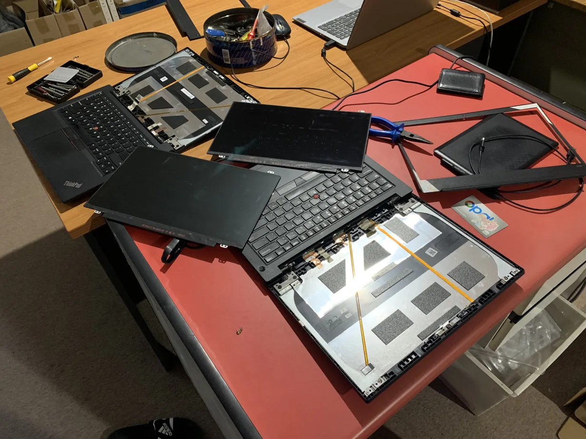
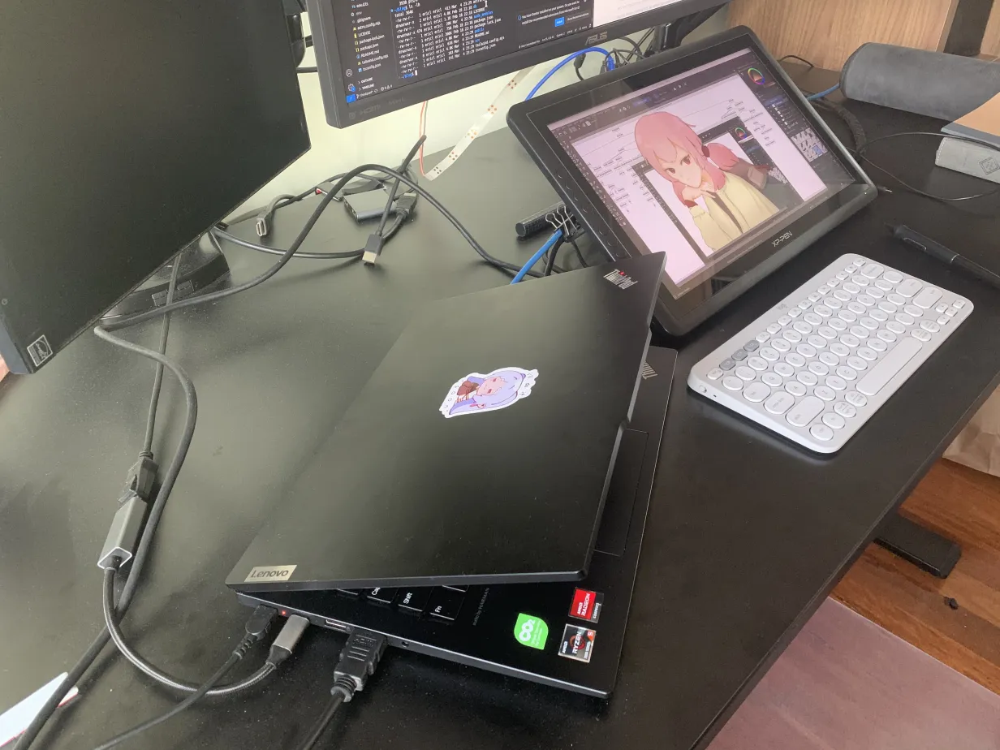

## My Ex; ThinkPad E495

My dad had an old ThinkPad running windows vista that seemed to have a life expectancy greater than me. With this good reputation of Lenovo engrained into my brain, I recommended my younger brother a Thinkpad E490 for highschool and it seemed to work well enough for him. So when my Acer aspire 5 broke in year 12, my requirements were just something that could run OneNote and Discord. I ended up getting basically the same laptop as my brother but with an AMD chip being the Thinkpad E495 (refurbished). It was $600 and a noticeable downgrade from the aspire 5 in terms of performance, screen and storage.

The switched <kbd>Ctrl</kbd> and <kbd>Fn</kbd> keys kinda messed with my head for a bit but I got over it pretty quickly. What messed with me the most was the terrible screen. While it was perfectly fine for doing homework and regular browsing, doing digital art on it was a nightmare. The 720p resolution just wasn't doing it for me while the colour inaccuracy made me want to cry at times when the exported image would look so different on my phone screen. Additionally, during 2021, the laptop would frequently BSOD and being days out from exams, I would have died if it weren't for Dean clutching up by letting me borrow his laptop.

<blockquote class="twitter-tweet">
  

    20 days out from finals 😅{" "}
    <a href="https://t.co/OoHUiERWyR">pic.twitter.com/OoHUiERWyR</a>
  

  &mdash; RICEL123 (@ricel123){" "}
  <a href="https://twitter.com/ricel123/status/1444997121350901762?ref_src=twsrc%5Etfw">
    October 4, 2021
  </a>
</blockquote> {" "}

Although the laptop did have some lows during my final year of highschool, we managed to work through that rough patch and using it throughout university worked perfectly fine as WSL (windows subsystem for linux) had worked mostly fine. It did everything I needed however was also kind of showing its age with compile times and the laptop always running hot. So, when I saw windows 11 trying to add the ai slop of copilot into the taskbar, I knew it was time to switch over to linux.

I split the 256gb SSD into a 50gb partition for windows (windows itself took up 47gb making it basically useless) and the rest for [Debian 12 bookworm](https://www.debian.org/releases/bookworm/) with [KDE](https://kde.org/plasma-desktop/). I decided on Debian because the computers at university were running it which gave me the impression that it had to be at least a little reliable. As for the desktop environment, I decided on KDE because I'd been married to [Krita](https://krita.org) for a while and so, upon hearing they were a part of the KDE group, I had no choice but to choose it.

I would frequently add stickers to my E495, while also giving her princess treatment. I upgraded the ram and storage with parts from old laptops, replaced the broken charging cable and when the screen started doing some chromatic aberration, swapped it for the screen in my brother's e490 (love how easy it is to replace parts in a Lenovo). I was prolonging my beloved's life but she was moving onto a better place.

Valenties day, 2025. My beloved E495 with all its upgraded parts breathed its final breath as it started to randomly glitch, freeze and eventually stop turning on altogether. My efforts in trying to diagnose and resolve the problem by trying different batteries and screens were futile and as uni started to roll around, it was time to move on.

## A new season: The ThinkPad E14 Gen 6

With little time to spare before uni was about to kick in, I looked at the options available on the lenovo website without even considering other brands. I wanted a laptop that would last me till the end of my computer science degree and for many years afterwards when I would hopefully be working full time with it. At the time I had $3k in my bank account with no income while crashing at a Dean's place. If I spent around $1k on a security deposit for a new place to rent and about $1k on a new laptop, it meant I would have a little less than a month to get some income before being dead broke on the streets. So, my conclusion was the ThinkPad E14 Gen 6.

It took a swift 2 days to arrive and as soon as I got it, decided to add my old SSD so I could dual boot to linux without partitioning. Though the back of the laptop was extremely difficult to get off, with the help of some pill packets and an id card, the SSD was installed in the extra NVMe slot.

Although the <kbd>PtrSc</kbd> button was replaced by the revoluting copilot button, I was able successfully dodge microsoft at the os level as everything seemed to be working correctly, except for the wifi. As it turns out, Debian 12.9 doesn't support Realtek RTL8852ce wifi chips out the box. I tried switch out the wifi chip with my old laptop's one and even tried to manually install the correct drivers but without wifi to install them, I just gave up.

So, it was time to choose a new os that supported the wifi chips out the box and I landed on [linux mint 22.1](https://www.linuxmint.com/edition.php?id=319). Although I thoroughly enjoyed KDE plasma, I thought it would only be natural to try the [Cinnamon desktop environment](https://projects.linuxmint.com/cinnamon/) as the only things I needed was a browser, vscode and krita. I downloaded it and everything seemed to work beautifully.

### Review

After a couple weeks of using it, let's review this ThinkPad.

- The 14" form factor with the screen's 16:10 aspect ratio as opposed to the more common 16:9 is lovely to have for doing work which benefits from the extra height. The laptop itself is nice and portable; I think 14" might just be perfect. That screen is also bright and clear at 1080p however, putting it in my bag just once caused marks from the keyboard to be etched into the screen. So, try to avoid putting too much weight directly on the top of it closed.
- The metal chassis seems solid enough however, it makes it a lot harder to pop out the back of the laptop to do upgrades or repairs. It also is a finger print magnet but if you just keep wiping, I guess it'll be fine
- The fingerprint scanner doesn't seem to work but I wasn't planning on using it anyways but maybe I'll claim some warranty fix later down the line?
- The keyboard feels decent and it has backlighting in case you are working in a dark lecture theater. The only issue is with the ugly copilot button though i could try to find a small sticker to cover it up
- The touch pad is pretty average and works as intended but I prefer a mouse instead (though I probably should learn more shortcuts to never leave my keyboard)
- It has 2 usb-c ports which is great because you can use one for charging and the other for your monitors. If you need hdmi, it also has that as well as two usb-a ports, an audio jack and an ethernet port. Although the ethernet port didn't initially detect cables plugged in, after a week, it just magically started working again.
- The speakers are great and work well when you don't want to cover your ears in the hot Australian summers
- The webcam seems pretty average along with the microphone. You can manually close the webcam with a slider but I feel like if I was paranoid enough I would just use my own sticky tape.
- The screen bezels are nice and thin though the forehead has a funny bulge which doesn't exactly align to the bottom part when closed which makes for an easier opening experience but still feels wrong.
- The 512gb storage is more than what I need for my use case as I upload everything to the cloud anyways. 512gb for windows and 256 for linux mint is more than enough - though maybe i'll install Arch BTW on the 512gb stick
- The processor being the AMD Ryzen 5 7535HS with Radeon Graphics x 6 seems to work without any crazy differences. Hot reloading for React apps and browsing seems barely faster than my old laptop. The only major difference is with compiling my rust programs.
- The graphics card is meant to be integrated with the CPU which is good because that one less piece of hardware to worry about braking. I think it's working fine? But some applications like tetr.io will crash because of WebGL errors - is this my fault for not installing some drivers? Kdenlive and the OBS don't seem to be suffering from a graphics issues and in fact, run quite nicely
- The memory being at 16gb is fine as well but with linux being so lightweight, I ain't even getting my money's work
- The battery life isn't the best as the CPU is quite greedy but thankfully using linux allows me to prolong it to about 6 hours of life.

The laptop seems to be working perfectly fine. Linux mint is running everything I need to do work, uni and play. Upon getting an XP-Pen I could borrow to draw, I was worried about a lack of linux driver support that is prevalent with Wacom, but XP-Pen devs are the lads and the only issue occurs when sleeping the laptop causes the pen to be undetected. Although the apt pack manager isn't the best, it gets the job done so linux mint has a green tick in my books. However, the Cinnamon DE is just not as featureful as my beloved KDE. Maybe I will go back to KDE in the future after trying i3 or something.

## Conclusion

The ThinkPad E14 Gen 6 AMD works perfectly fine with linux mint and cinnamon. I can code, draw, watch lectures and youtube and even dabble in some light tetris or study strims which is all I need from a laptop. I guess I could try to push the laptop to use more of its resources but that would be for a later time if I ever try 3D rendering or playing triple A titles.

All in all, seems like a pretty decent laptop and I hope it will last me many years to come.
